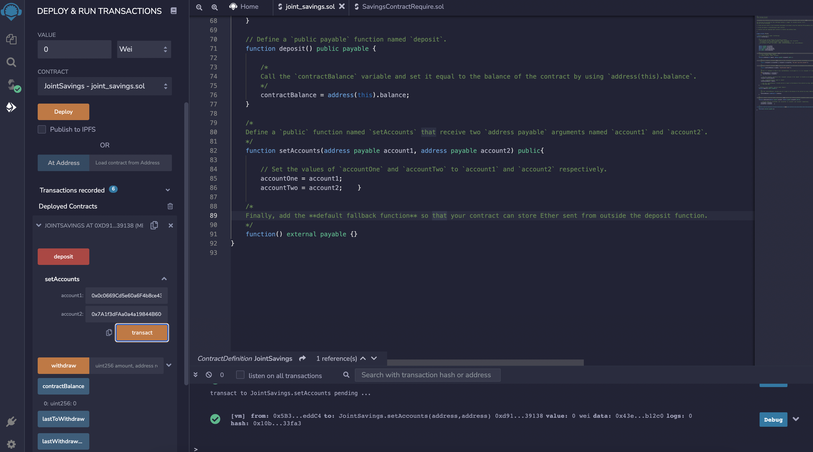
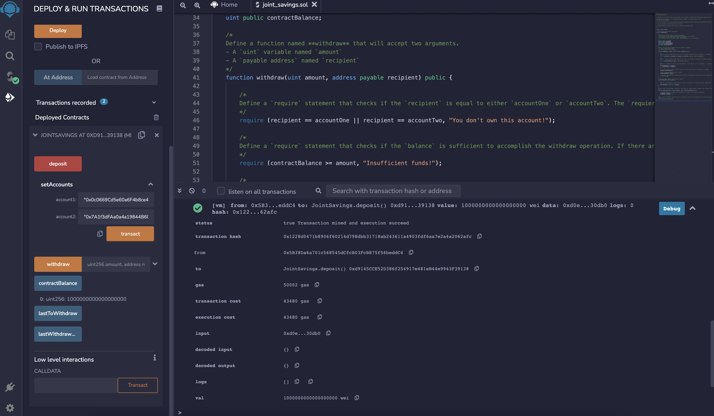
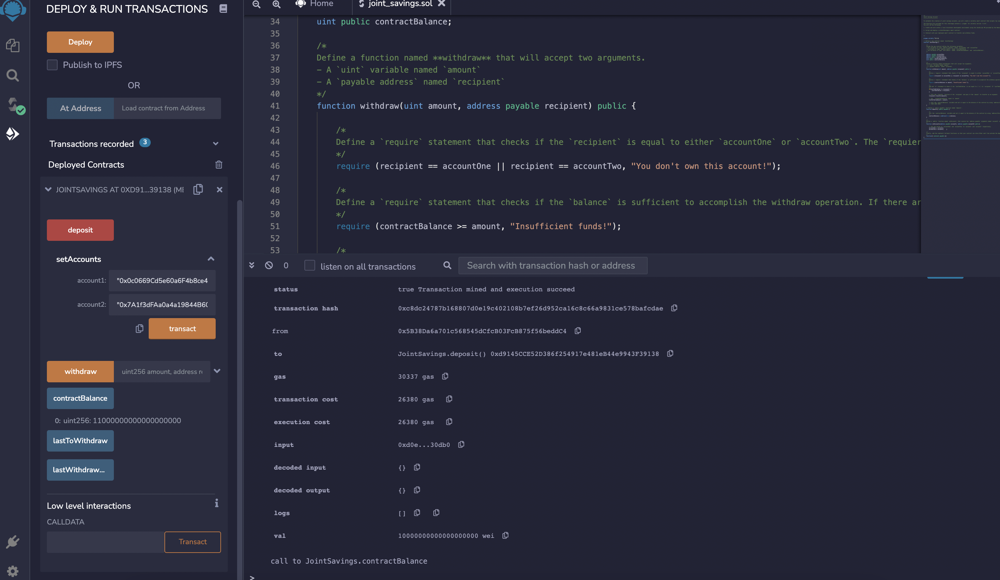
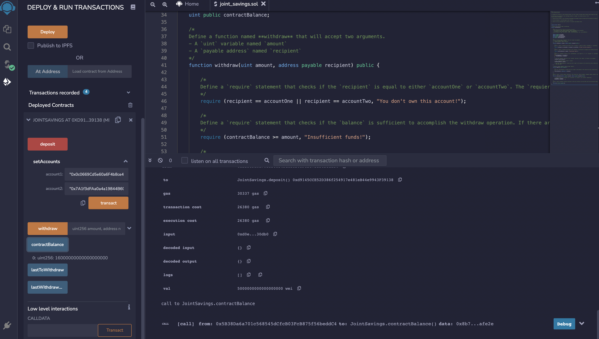
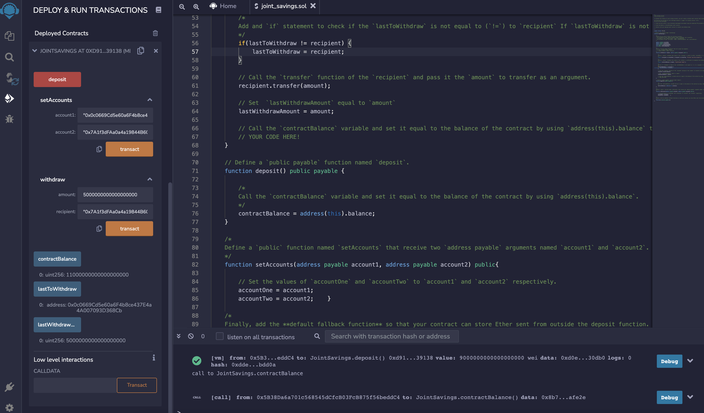
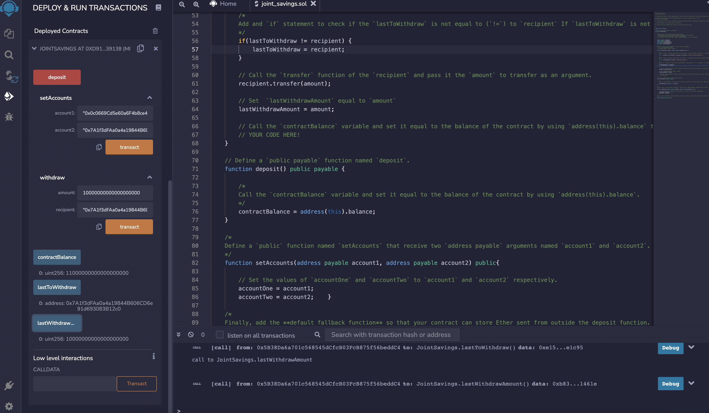
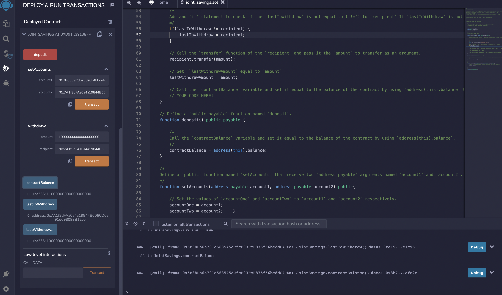
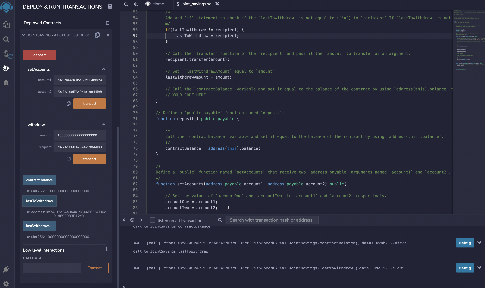
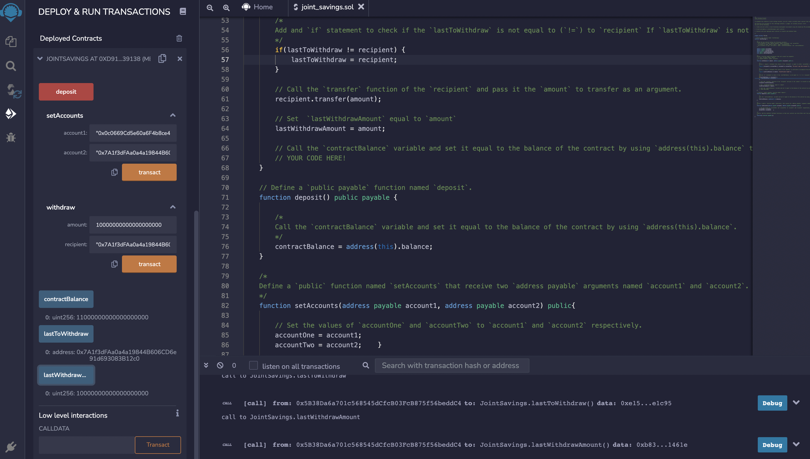

# 20_Smart_Contracts_Solidity

### This project aims to automate the creation of joint savings accounts by creating a Solidity smart contract that accepts two user addresses. This smart contract will use ether management functions to implement a financial institution’s requirements for providing the features of the joint savings account. These features will consist of the ability to deposit and withdraw funds from the account.

---

## Technologies

This project leverages Solidity and the web version of the Remix IDE to build and test the smart contracts.

- [Remix IDE](https://remix.ethereum.org/#optimize=false&runs=200&evmVersion=null&version=soljson-v0.8.7+commit.e28d00a7.js) - is an open source application for developing, deploying, and administering smart contracts that run in Ethereum-based blockchains. We can use this IDE for the entire development cycle of smart contracts and as a playground for teaching and learning Ethereum. The Remix IDE is available in both web and desktop versions.

---

## Deployed Smart Contract

After compiling and deploying the contract, it is important to test its functionality. Below are screenshots to verify the executions.

1. `setAccounts` verification
   

2. Transaction 1: send 1 ether as wei
   

3. Transaction 2: send 10 ether as wei
   

4. Transaction 3: send 5 ether
   

5. Withdraw 1: withdrawing 5 ether into `accountOne`
   

6. Withdraw 2: withdrawing 10 ether into `accountTwo`
   

7. `contractBalance` verification
   

8. `lastToWithdraw` verification
   

9. `lastWithdraw` verification
   
